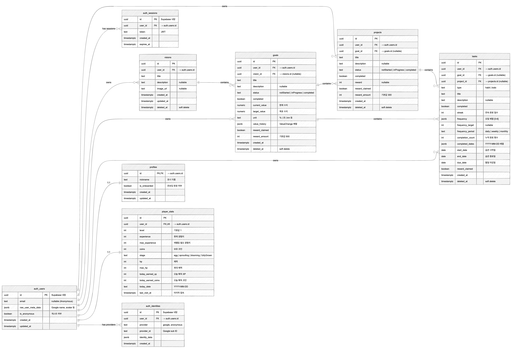

# Irusol - Gamified Habit Tracker 🎮✨

RPG 요소가 있는 습관 관리 앱입니다. 습관을 완료하면 경험치를 얻고, 캐릭터를 성장시키세요!

**Enjoy game and manage habit!**

## ✨ 주요 기능

### 🎯 습관 & 목표 관리
- **Habits** - 반복 주기 설정 가능한 습관 (매일/요일별)
- **To Do's** - 한 번 완료하면 되는 할일
- **Goals** - 수치 추적이 가능한 목표 (현재값/목표값/단위)
- **Projects** - 목표에 연결된 프로젝트 관리
- **Visions** - 장기 비전 보드

### 🎮 RPG 게이미피케이션
- **레벨 시스템** - 태스크/목표 완료 시 난이도 기반 XP + Coins 획득
- **진화 시스템** - egg → sproutling → blooming → fullyGrown
- **캐릭터 아바타** - 진화 단계별 마스코트 변화
- **온보딩 퀘스트** - 초보자 가이드 시스템

### 📅 캘린더
- **월간/주간 뷰** - 전환 가능한 캘린더 뷰
- **날짜별 태스크** - 날짜별 완료 현황 확인
- **부재 패널티** - 미완료 습관에 대한 패널티 시스템

### 🔐 인증 & 데이터
- **Google OAuth** - Google 계정 로그인
- **게스트 로그인** - Supabase Anonymous Auth
- **Supabase DB** - 서버 동기화 (RLS 적용)
- **Zustand + localStorage** - 클라이언트 상태 자동 persist

### 🌐 다국어
- **한국어 / 영어** - next-intl 기반 locale 라우팅

## 🚀 시작하기

### 환경 변수 설정

```bash
# .env.local
NEXT_PUBLIC_SUPABASE_URL=your_supabase_url
NEXT_PUBLIC_SUPABASE_ANON_KEY=your_supabase_anon_key
```

### 의존성 설치 및 실행

```bash
npm install
npm run dev
```

브라우저에서 [http://localhost:3000](http://localhost:3000)을 열어 앱을 사용하세요.

### 프로덕션 빌드

```bash
npm run build
npm start
```

### 테스트

```bash
npm run test:e2e          # Playwright E2E 테스트
npm run test:e2e:ui       # Playwright UI 모드
npm run test:e2e:headed   # 브라우저 표시 모드
```

## 📦 기술 스택

### Core
- **Next.js 15** (App Router) + **React 19** + **TypeScript 5**
- **Tailwind CSS 3.4** - 유틸리티 CSS + 커스텀 디자인 토큰
- **Zustand 5** - 클라이언트 상태 관리 (persist 미들웨어)

### Backend & Auth
- **Supabase** - PostgreSQL DB + Auth + RLS (Row Level Security)
- **@supabase/ssr** - Next.js 서버 사이드 Supabase 통합
- **Google OAuth** - 소셜 로그인
- **Anonymous Auth** - 게스트 로그인

### UI & Animation
- **Framer Motion 11** - 애니메이션
- **react-calendar** - 달력 컴포넌트
- **react-icons** - 아이콘
- **next-intl 4.8** - 다국어 (i18n)
- **date-fns 4** - 날짜 처리

### Testing & Deployment
- **Playwright** - E2E 테스트
- **ESLint** - 린팅
- **Vercel** - 배포

## 🌐 Vercel 배포

### 방법 1: Vercel CLI 사용

```bash
npm install -g vercel
vercel
```

### 방법 2: GitHub 연동

1. GitHub 저장소에 푸시
2. [Vercel](https://vercel.com)에서 "Import Project"
3. GitHub 저장소 선택 → 자동 배포

> Vercel 환경 변수에 `NEXT_PUBLIC_SUPABASE_URL`, `NEXT_PUBLIC_SUPABASE_ANON_KEY` 설정 필요

## 🏗️ 시스템 아키텍처


## 🗄️ ERD (Entity Relationship Diagram)



## 📁 프로젝트 구조

```
irusol/
├── src/
│   ├── app/
│   │   ├── [locale]/           # Locale-based App Router
│   │   │   ├── page.tsx        # 메인 (리다이렉트)
│   │   │   ├── login/          # 로그인 페이지
│   │   │   ├── onboarding/     # 온보딩 페이지
│   │   │   ├── goals/          # 목표 관리
│   │   │   ├── projects/       # 프로젝트 관리
│   │   │   ├── calendar/       # 캘린더 뷰
│   │   │   ├── character/      # 캐릭터 상세
│   │   │   ├── stats/          # 통계 페이지
│   │   │   └── settings/       # 설정 (언어 등)
│   │   └── auth/callback/      # OAuth 콜백
│   ├── components/             # React 컴포넌트
│   │   └── calendar/           # 달력 전용 컴포넌트
│   ├── store/                  # Zustand 스토어
│   │   ├── useAuthStore.ts     # 인증 상태
│   │   ├── usePlayerStore.ts   # 플레이어 (레벨, XP, 코인)
│   │   ├── useTaskStore.ts     # 태스크 (습관, 할일)
│   │   ├── useGoalStore.ts     # 목표
│   │   ├── useProjectStore.ts  # 프로젝트
│   │   ├── useVisionStore.ts   # 비전
│   │   ├── useCalendarStore.ts # 캘린더 상태
│   │   ├── useOnboardingStore.ts # 온보딩
│   │   └── useToastStore.ts    # 토스트 알림
│   ├── lib/
│   │   ├── evolution.ts        # 레벨업 & 진화 로직
│   │   ├── rewards.ts          # 보상 계산 (XP, Coins)
│   │   ├── migrations.ts       # localStorage 스키마 마이그레이션
│   │   ├── calendar-utils.ts   # 캘린더 유틸
│   │   ├── taskProgress.ts     # 태스크 진행률
│   │   ├── onboardingTemplates.ts # 온보딩 템플릿
│   │   └── supabase/           # Supabase 클라이언트
│   │       ├── client.ts       # 브라우저 클라이언트
│   │       ├── server.ts       # 서버 클라이언트
│   │       ├── middleware.ts   # 미들웨어 클라이언트
│   │       └── sync.ts         # DB 동기화 로직
│   ├── i18n/                   # next-intl 설정
│   └── types/index.ts          # TypeScript 타입
├── messages/                   # 번역 파일 (ko.json, en.json)
├── agents/                     # Claude Code 에이전트
├── e2e/                        # Playwright E2E 테스트
└── public/                     # 정적 파일 (이미지 등)
```

## 🎮 사용 방법

### 1. 로그인
- Google 계정 로그인 또는 게스트로 체험
- 첫 로그인 시 온보딩 퀘스트 진행

### 2. 습관/할일 추가
- **+** 버튼으로 태스크 생성
- 난이도(쉬움/보통/어려움) 설정 → 보상 차등

### 3. 목표 & 프로젝트
- 수치 추적 가능한 목표 설정 (예: 독서 30권)
- 목표에 프로젝트 연결하여 세부 관리

### 4. 레벨업 & 진화
- 태스크 완료 → XP 획득 → 레벨업
- Base XP 25, 레벨마다 +5씩 요구량 증가
- 진화: egg → sproutling → blooming → fullyGrown

### 5. 캘린더
- 월간/주간 뷰 전환
- 날짜별 습관 완료 현황 확인

## 🐛 알려진 제한사항

- Mana 시스템 미구현
- 일/주 자동 리셋 미구현
- Social 기능 미구현
- 오프라인 모드에서는 Supabase 동기화 불가

## 📄 라이선스

MIT

---

**Inspired by Habitica** - 습관을 게임처럼 즐겁게! 🎉
