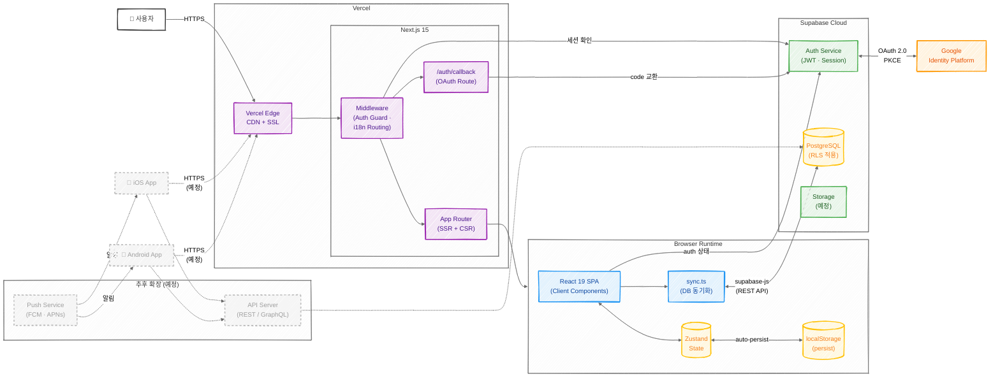
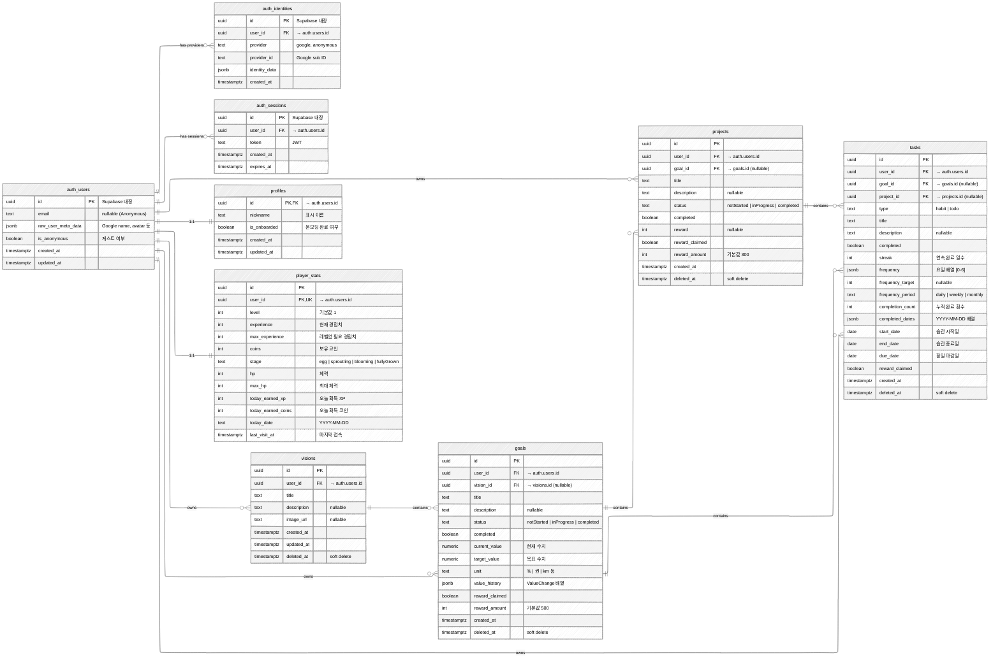

# Irusol - 시스템 구성도

## System Architecture Diagram

### 범례

| 색상 | 영역 | 설명 |
|------|------|------|
| 🟣 보라 | Vercel | CDN, Middleware, App Router, OAuth Callback |
| 🔵 파랑 | Browser | React SPA, sync 모듈 |
| 🟢 초록 | Supabase | Auth Service, Storage |
| 🟡 노랑 | DB / Store | PostgreSQL(RLS), Zustand, localStorage |
| 🟠 주황 | External | Google Identity Platform |
| ⬜ 회색 점선 | 예정 | iOS App, Android App, API Server, Push Service |

| 선 종류 | 의미 |
|---------|------|
| 실선 (`→`) | 현재 구현된 연결 |
| 점선 (`-.->`) | 추후 구현 예정 |

### Supabase DB ERD

#### RLS 정책 요약

| 테이블 | SELECT | INSERT | UPDATE | DELETE |
|--------|--------|--------|--------|--------|
| `profiles` | `id = auth.uid()` | trigger on signup | `id = auth.uid()` | - |
| `player_stats` | `user_id = auth.uid()` | trigger on signup | `user_id = auth.uid()` | - |
| `visions` | `user_id = auth.uid()` | `user_id = auth.uid()` | `user_id = auth.uid()` | soft delete |
| `goals` | `user_id = auth.uid()` | `user_id = auth.uid()` | `user_id = auth.uid()` | soft delete |
| `projects` | `user_id = auth.uid()` | `user_id = auth.uid()` | `user_id = auth.uid()` | soft delete |
| `tasks` | `user_id = auth.uid()` | `user_id = auth.uid()` | `user_id = auth.uid()` | soft delete |

> - 모든 public 테이블에 `user_id = auth.uid()` RLS 정책 적용
> - `profiles`, `player_stats`는 회원가입 시 DB trigger로 자동 생성
> - 삭제는 soft delete (`deleted_at` 타임스탬프) 방식 — 실제 row 삭제 없음
